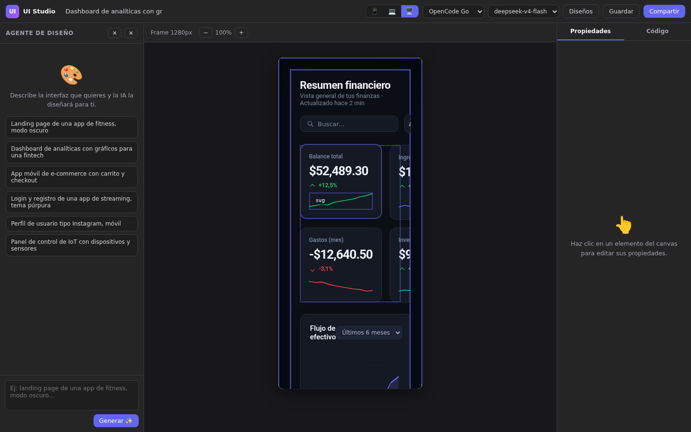
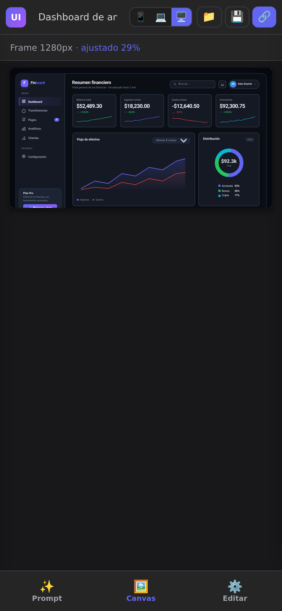
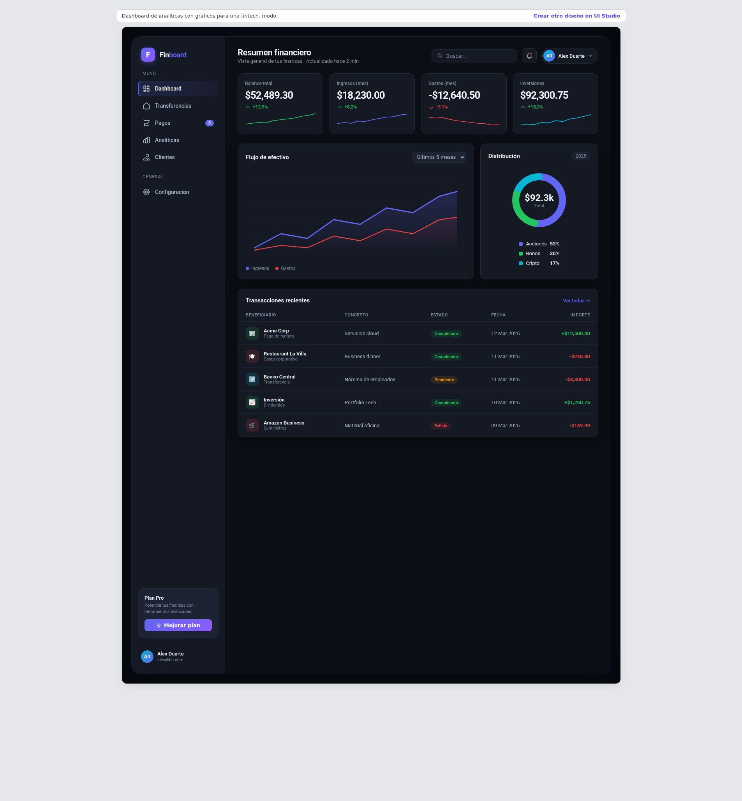

# 🎨 UI Studio — Diseña interfaces con IA (estilo Figma)

App web que **genera diseños UI desde un prompt** usando la API de opencode
(tus mismas claves, sin coste extra). Incluye vista previa en tiempo real,
**canvas editable tipo Figma**, editor de código, diseños guardados y
**enlaces públicos** para compartir. Totalmente responsive (móvil/tablet/escritorio).

## 🌐 Demo

**https://codedev-404.github.io/ui-studio-ai/**

## ✨ Características

- 🤖 **Generación con IA**: escribe un prompt (ej. *"landing de una app de fitness, modo oscuro"*) y la IA genera el HTML completo en streaming, viéndolo renderizarse en vivo.
- 🖱️ **Canvas editable estilo Figma**: haz clic en cualquier elemento del diseño y edita texto, colores, tamaño, padding, radio, peso y alineación en tiempo real. También puedes eliminar elementos.
- 📝 **Editor de código**: ve o edita el HTML/CSS generado y sincronízalo con el canvas en ambas direcciones.
- 🔗 **Enlaces públicos**: comparte cualquier diseño con un enlace que lo abre en otra ventana, sin necesidad de la app.
- 💾 **Diseños guardados**: se guardan automáticamente; lista, reabre y borra desde el panel "Diseños".
- 📱 **Frames por dispositivo**: móvil (390px), tablet (768px) y escritorio (1280px), con zoom y auto-ajuste.
- 🧠 **Modelos múltiples**: OpenCode Zen y OpenCode Go con decenas de modelos (Claude, GPT, Gemini, DeepSeek, Kimi, GLM…).
- 📱💻🖥️ **Responsive**: tres layouts según la pantalla (escritorio de 3 columnas, tablet con paneles reducidos y móvil con navegación inferior y paneles deslizables).

## 🖼️ Capturas

| Editor (escritorio) | Edición de propiedades |
|---|---|
|  |  |

| Editor (móvil) | Página pública de un diseño |
|---|---|
|  |  |

## 📋 Requisitos

- [opencode](https://opencode.ai) instalado y con credenciales configuradas
  (`~/.local/share/opencode/auth.json` con los providers `opencode` y/o `opencode-go`)
- Node.js 20+

## 🚀 Instalación y uso

```bash
# 1. Clonar el repositorio
git clone https://github.com/CodeDev-404/ui-studio-ai.git
cd ui-studio-ai

# 2. Instalar dependencias del frontend y compilarlo
cd client
npm install
npm run build
cd ..

# 3. Arrancar el servidor
./start.sh
```

Abre **http://localhost:3456** en el navegador.
Si quieres abrirla desde otro dispositivo de la misma red, el servidor
imprime tu IP local al arrancar (ej. `http://10.2.0.2:3456`).

### Desarrollo del frontend

```bash
cd client
npm install
npm run dev    # Vite en :5173 con proxy al backend (:3456)
```

### Tests

```bash
cd server
node --test    # tests unitarios del servidor
```

## 🧑‍🎨 Cómo se usa

1. **Generar**: escribe un prompt en el panel izquierdo (o usa una sugerencia)
   y pulsa **Generar**. Elige el frame según el dispositivo (📱 💻 🖥️).
2. **Editar como en Figma**: haz clic en cualquier elemento del diseño.
   El panel derecho muestra sus propiedades y puedes modificarlas en vivo.
3. **Código**: pestaña **Código** para ver/editar el HTML.
   *"← Del canvas"* sincroniza los cambios visuales al código.
4. **Guardar**: los diseños se guardan solos al generarse; **Diseños**
   los lista para reabrirlos o borrarlos.
5. **Compartir**: genera un enlace público (`/p/<id>`) que abre el diseño
   en otra ventana, sin la app y sin exponer tus claves.

## 📁 Estructura del proyecto

```
ui-studio-ai/
├── .github/workflows/ci.yml   # CI: build del frontend + tests del servidor
├── docs/screenshots/          # Capturas del README
├── start.sh                   # Arranca el servidor (puerto 3456)
├── server/                    # Backend Node (Express)
│   ├── index.js               # API: /api/generate (SSE), /api/models, /api/designs, /p/:id
│   ├── ai.js                  # Cliente de la API de opencode (Zen y Go) + prompt del diseñador
│   ├── store.js               # Persistencia de diseños (server/data/designs.json)
│   ├── test/ai.test.js        # Tests unitarios (extracción de HTML)
│   └── data/                  # Diseños guardados (ignorado por git)
└── client/                    # Frontend React + Vite
    └── src/
        ├── App.jsx            # Layout, estado y navegación responsive
        ├── agent.js           # Agente inyectado en el iframe (selección/edición)
        ├── api.js             # Cliente HTTP del backend
        ├── useMediaQuery.js   # Hook responsive
        └── components/        # TopBar, PromptPanel, Canvas, PropertiesPanel, CodeEditor, dialogs
```

## 🔌 API

| Método | Ruta | Descripción |
|---|---|---|
| `POST` | `/api/generate` | Genera un diseño desde un prompt (SSE streaming). Body: `{ prompt, model, gateway, width }` |
| `GET` | `/api/models` | Lista de modelos disponibles por gateway |
| `GET` | `/api/designs` | Lista de diseños guardados (sin HTML) |
| `GET` | `/api/designs/:id` | Detalle de un diseño (con HTML) |
| `PUT` | `/api/designs/:id` | Actualiza un diseño (título, HTML, prompt) |
| `DELETE` | `/api/designs/:id` | Elimina un diseño |
| `GET` | `/p/:id` | Página pública de un diseño |
| `GET` | `/p/:id/design` | HTML limpio del diseño (para el iframe público) |

## 🛡️ Seguridad

- Las **claves de la API nunca llegan al navegador**: se leen del
  `auth.json` de opencode en el servidor y solo se usan para llamar a la API.
- Los enlaces públicos exponen únicamente el HTML del diseño, sin claves
  ni acceso a la API.
- Los diseños se renderizan en un iframe aislado (`sandbox="allow-scripts"`).

## 🛠️ Solución de problemas

| Problema | Solución |
|---|---|
| No carga la lista de modelos | Verifica que `~/.local/share/opencode/auth.json` tenga los providers `opencode` y `opencode-go` |
| "API error 401" al generar | El gateway seleccionado no tiene credenciales; prueba con el otro gateway o con otro modelo |
| El puerto 3456 está ocupado | `cd ui-studio-ai && ./start.sh` reinicia el servidor (mata el proceso anterior vía pidfile) |
| El diseño se ve cortado | El modelo alcanzó el límite de tokens; prueba con un modelo más potente o un prompt más específico |

## 📄 Licencia

MIT
